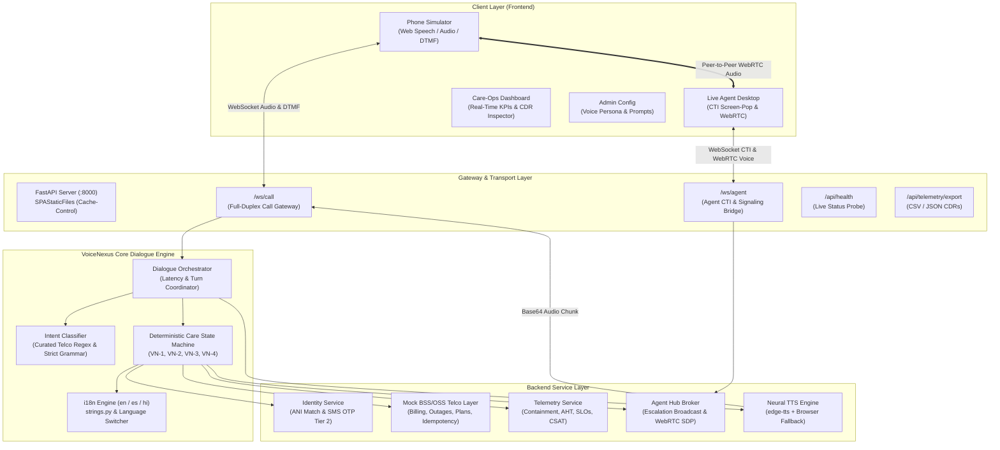

# VoiceNexus — Conversational IVR Platform (v1.0)

> **"Turn IVR into resolution, not frustration."**

[](https://www.python.org/)
[](https://fastapi.tiangolo.com)
[](https://react.dev/)
[](https://www.typescriptlang.org/)
[](https://vitejs.dev/)
[](https://tailwindcss.com/)
[](https://webrtc.org/)
[](docs/PRD.md)
[](USER_GUIDE.md)

VoiceNexus is an enterprise-grade AI IVR platform engineered for **telecommunications, broadband, and cable service providers**. It replaces rigid, labyrinthine touch-tone phone trees with sub-second, natural-language conversations that resolve routine customer care inquiries in-flow while escalating smoothly to live agents with verified context and zero customer repetition.

> 📖 **Looking for a non-technical overview?** Read the [Non-Technical User Guide](USER_GUIDE.md) for step-by-step role walkthroughs, guided interactive tours, and a non-technical FAQ.

---

## 📑 Table of Contents

- [Core Experience Principles](#-core-experience-principles)
- [System Architecture](#-system-architecture)
- [Key Features & PRD Compliance](#-key-features--prd-compliance)
- [Recent Updates & Enhancements](#-recent-updates--enhancements)
- [Repository Structure](#-repository-structure)
- [Prerequisites & Installation](#-prerequisites--installation)
- [Running VoiceNexus](#-running-voicenexus)
- [Interactive Demo Profiles & Test Scenarios](#-interactive-demo-profiles--test-scenarios)
- [Automated Testing](#-automated-testing)
- [Care-Ops Telemetry & KPIs](#-care-ops-telemetry--kpis)
- [Configuration & Brand Customization](#-configuration--brand-customization)
- [License](#-license)

---

## 🎯 Core Experience Principles

VoiceNexus is engineered around four core principles defined in the [Product Requirements Document](docs/PRD.md):

1. **Identity before action**: Verify who is calling via passive ANI lookup, knowledge-based security questions (KBA), or SMS OTP before disclosing account records or executing financial commitments.
2. **Confirm before committing**: Explicitly restate intent, dollar amounts, and commitment dates prior to charging cards, applying rate changes, or booking field technician dispatches.
3. **Honest limits**: Clear, plain-language statements when a request exceeds AI boundaries — strictly zero hallucinations or fabricated answers.
4. **Clean transfer**: An escalation that lands a live agent with verified identity, intent summary, and dialogue history is always superior to a bot guessing.

---

## 🏗️ System Architecture

VoiceNexus employs an asynchronous, full-duplex pipeline delivering sub-second response latency (`≤ 1.0s` target):



---

## ✨ Key Features & PRD Compliance

| PRD Ref | Requirement | Platform Implementation |
| :--- | :--- | :--- |
| **VN-1** | Natural-Language Intent Recognition | High-accuracy NLU matching across top telecom intents: Billing, Payment Promises, Card Payments, Outage Inquiries, Router Diagnostics, Speed Upgrades, Callback Requests, and Escalations. |
| **VN-2** | Goal-Directed Subflows | Deterministic state machine executing transactional subflows with explicit confirmation prompts before irreversible actions. |
| **VN-3** | Multi-Tier Identity Verification | **Tier 1**: Passive Automatic Number Identification (ANI) match against BSS/OSS accounts.<br>**Tier 1.5**: Knowledge-Based Authentication (KBA) for unregistered numbers (Billing ZIP / Account #).<br>**Tier 2**: Step-up SMS OTP challenge (`1234`) for plan rate changes and high-risk actions. |
| **VN-4** | Routine Transaction Completion | - **Billing**: Real-time balance inquiry, card on file charge (`...4242`), and idempotent payment arrangements.<br>- **Outage Triage**: Real-time ZIP outage check, optical line terminal diagnostics, remote router reset signal, and field technician dispatch.<br>- **Plan Management**: Speed comparison and Gigabit promotional upgrades.<br>- **Callbacks**: Asynchronous queue scheduling. |
| **VN-5** | Structured Escalation & Handoff | Automated generation of standardized `EscalationPayload` containing verified subscriber details, primary intent, escalation reason, balance, and dialogue transcript. |
| **VN-6** | Care-Ops Telemetry & Performance | Real-time computation of Containment Rate (%), Agent Transfer Rate (%), Abandonment Rate (%), Automated vs Escalated AHT, Median Turn Latency (SLO-breach tracking), CSAT ratings, and one-click CSV export. |
| **VN-7** | Brand Voice Tuning & Pronunciation | Live configuration of Microsoft Neural voices, primary language, speech rate (-25% to +25%), pitch, and regex-based phonetic acronym pronunciation overrides (`ONT` → `O-N-T`, `VoIP` → `Voice over I-P`, `Gbps` → `gigabits per second`). |
| **VN-8** | Callback Scheduling | Queue reservation flow for asynchronous customer callback with preferred time window selection. |
| **VN-9** | Tenant Branding & Legal Disclosures | Configurable operator branding (*NexusFiber*), multilingual greetings, hold/escalation prompts, and automated regulatory recording disclosure. |
| **VN-10** | Live Agent Desktop & WebRTC Bridge | Real-time CTI Screen-Pop feed, AI Next-Best-Action guidance, live in-flight transcript streaming, and a full two-way WebRTC voice bridge for direct caller-to-agent audio. |

---

## 🚀 Recent Updates & Enhancements

The platform has recently undergone substantial architectural hardening and UX polish:

- **QA Suite Hardening & Bug Fixes** (`test_qa_suite_fixes.py`, 8 new regression tests):
  - **Plan Flow Fix**: Resolved a stuck transition where hearing plan details before requesting an upgrade (*"What plan am I on?"* → *"Can I upgrade?"*) failed to route into the upgrade offer; added an explicit `DETAILS_PROVIDED` step handling upgrade/decline/fallback branches in English, Spanish, and Hindi.
  - **DTMF Numeric Confirmation**: Touch-tone `1` / `2` now resolve as universal affirmative/negative confirmations (e.g. confirming a card payment or a payment arrangement) across every subflow, not just the dialpad menu.
  - **Multilingual Goodbye Handling**: Parting phrases (*"Goodbye"*, *"Adiós, muchas gracias"*, *"अलविदा, धन्यवाद"*) are now recognized as gratitude/closing intents and resolve the call cleanly instead of falling through to an unrecognized-turn counter.
  - **Multilingual Escalation Prompt**: Added dedicated Spanish and Hindi `escalation.prompt` strings so a live-agent handoff is announced in the caller's active language instead of silently falling back to English.
  - **Robust Affirmative/Negative Matching**: `is_affirmative` / `is_negative` now tokenize input (word-boundary matching) instead of naive substring checks, eliminating false positives (e.g. "nowhere" no longer matching "no") while still catching numeric DTMF input and multi-word phrases.
  - **Telemetry Deduplication**: `record_completed_call` now updates the existing Call Detail Record in place when a session resolves more than once (e.g. a parting turn following a prior resolution) instead of inserting a duplicate row, and preserves any already-captured CSAT rating.
  - **Agent Hub Cleanup**: `unregister_caller` now also purges any pending escalation payload for that session, preventing stale escalations from lingering in the Agent Desktop queue after a caller disconnects.

- **Multilingual Dialogue Engine (`en`, `es`, `hi`)**:
  - Full native dialogue support for **English**, **Spanish**, and **Hindi**.
  - Dynamic, mid-call language switching (e.g., *"Quiero hablar en español"*, *"hindi mein baat karo"*, *"switch back to english"*). The conversational state machine preserves active session context across language transitions.
  - Dedicated neural voices for each language (`en-US-JennyNeural`, `es-US-PalomaNeural`, `hi-IN-SwaraNeural`).

- **Two-Way WebRTC Voice Bridge**:
  - Direct browser-to-browser voice communication between caller and live care specialist.
  - Added `recvonly` transceiver fallback so callers or agents without microphone permissions can still hear incoming audio.
  - Dynamic mute/unmute controls and one-click agent canned voice responses.

- **FastAPI `SPAStaticFiles` Cache-Control**:
  - Custom static file handler ensuring `index.html` revalidates immediately (`Cache-Control: no-cache`), while Vite's content-hashed assets (`assets/*.js`) receive long-term immutable caching. Eliminates stale-bundle cache bugs during live demos.

- **Live Backend Health Indicator (`useHealthCheck`)**:
  - Real-time polling of `/api/health` with a visual status pill in the navbar (`Online`, `Checking`, `Offline`), replacing decorative dots.

- **In-Flight Turn Debounce & Thinking State**:
  - UI-level protection (`awaitingResponse`) guarding against duplicate sends from rapid double-clicks or lingering `Enter` presses.
  - "VoiceNexus is thinking..." animated visual indicator during turn evaluation.
  - DTMF keypad is temporarily locked while audio or processing is in flight to eliminate race conditions.

- **Interactive Welcome Tour (`WelcomeGuide.tsx`)**:
  - A 4-step modal tour introducing evaluators to the Caller Simulator, Agent Desktop, Care-Ops Dashboard, and Admin settings.
  - Clarifies that every screen can be operated silently using typed inputs or one-click presets without requiring a microphone.

- **React Error Boundary (`ErrorBoundary.tsx`)**:
  - Catches unexpected runtime UI issues and presents a clean recovery screen with a reload button.

- **Custom ANI Dialing**:
  - Dial any phone number directly into the Phone Simulator to test unregistered caller flows and Knowledge-Based Authentication (KBA).

- **Telecommunications Data Export**:
  - One-click CSV and JSON download of Call Detail Records (CDRs) via `/api/telemetry/export`.

---

## 📁 Repository Structure

```
voicenexus/
├── backend/
│   ├── app/
│   │   ├── api/
│   │   │   ├── routes/
│   │   │   │   ├── admin.py              # Tenant voice/prompt configuration APIs (VN-7, VN-9)
│   │   │   │   ├── agent.py              # Live Agent Desktop CTI & signaling APIs (VN-5, VN-10)
│   │   │   │   └── telemetry.py          # Care-Ops metrics, CSAT & CDR export APIs (VN-6)
│   │   │   └── websocket_call.py         # Real-time Telephony / WebPhone Gateway
│   │   ├── engine/
│   │   │   ├── flows/
│   │   │   │   ├── billing_flow.py       # Billing balance, card payment, payment arrangement
│   │   │   │   ├── outage_triage_flow.py # Outage check, line diagnostics, router reboot
│   │   │   │   ├── plan_flow.py          # Plan inquiry & speed upgrades
│   │   │   │   └── callback_flow.py      # Async callback scheduler
│   │   │   ├── intent_classifier.py      # NLU intent pattern recognizer (F1 ≥ 0.90)
│   │   │   ├── nlu_utils.py              # Shared affirmative/negative detection
│   │   │   ├── orchestrator.py           # Dialogue turn & latency coordinator
│   │   │   └── state_machine.py          # Deterministic Care State Machine
│   │   ├── i18n/
│   │   │   ├── __init__.py               # t(key, lang, **kwargs) lookup helper
│   │   │   └── strings.py                # Centralized en/es/hi message templates (500+ lines)
│   │   ├── models/
│   │   │   └── schemas.py                # Pydantic schemas, CallState, EscalationPayload
│   │   ├── services/
│   │   │   ├── agent_hub.py              # Agent Desktop broadcast broker & WebRTC signaling
│   │   │   ├── bss_oss.py                # Mock Telco system of record & idempotency store
│   │   │   ├── identity.py               # ANI match, KBA verification, and SMS OTP
│   │   │   ├── stt.py                    # Speech-to-Text service (Whisper / Native)
│   │   │   ├── telemetry.py              # Metrics calculation, CSAT & CDR logger
│   │   │   └── tts.py                    # Neural streaming TTS engine (edge-tts)
│   │   ├── config.py                     # Tenant settings & latency targets
│   │   └── main.py                       # FastAPI application entrypoint & SPAStaticFiles
│   ├── data/
│   │   └── admin_config.json             # Persistent tenant configuration store
│   ├── tests/
│   │   ├── test_flows.py                  # Core dialogue, subflow, and language switch tests
│   │   ├── test_intent_benchmark.py       # Intent recognition benchmark suite
│   │   ├── test_issues_fixes.py           # Regression test suite for previous fixes
│   │   ├── test_qa_suite_fixes.py         # E2E QA regression suite (plan flow, DTMF, i18n goodbye/escalation, telemetry dedup)
│   │   ├── test_stt_service.py            # STT audio decoding & transcription tests
│   │   ├── test_telemetry_enhancements.py # Abandonment, CSAT & CSV export tests
│   │   └── test_websocket_e2e.py          # Full WebSocket & WebRTC voice bridge E2E tests
│   └── requirements.txt
├── docs/
│   └── PRD.md                            # Comprehensive Product Requirements Document
├── frontend/
│   ├── src/
│   │   ├── api/
│   │   │   └── client.ts                 # Typed fetch & WebSocket-URL wrappers
│   │   ├── components/
│   │   │   ├── shared/
│   │   │   │   ├── DistributionBarList.tsx # Shared percentage-bar breakdown
│   │   │   │   ├── MicStatusBadge.tsx      # Shared microphone status indicator
│   │   │   │   └── TranscriptList.tsx      # Shared dialogue-turn renderers
│   │   │   ├── AdminConfig.tsx           # Voice persona & tenant prompt editor (VN-7, VN-9)
│   │   │   ├── AgentDesktop.tsx          # CTI Screen-Pop & WebRTC Voice Bridge (VN-5, VN-10)
│   │   │   ├── ErrorBoundary.tsx         # React runtime error boundary
│   │   │   ├── OpsDashboard.tsx          # Care-Ops KPI metrics & CDR inspector (VN-6)
│   │   │   ├── PhoneSimulator.tsx        # Interactive WebPhone & Audio visualizer
│   │   │   └── WelcomeGuide.tsx          # 4-step quick-start onboarding tour
│   │   ├── data/
│   │   │   └── presets.ts                # Demo caller accounts and utterance scenarios
│   │   ├── hooks/
│   │   │   ├── useAdminConfig.ts         # Tenant config load/save hook
│   │   │   ├── useAgentWebSocket.ts      # Agent CTI bridge WS + WebRTC session
│   │   │   ├── useCallWebSocket.ts       # Caller phone WS + WebRTC session
│   │   │   ├── useHealthCheck.ts         # Backend health polling hook
│   │   │   ├── useSpeechRecognition.ts   # Browser Web Speech API wrapper
│   │   │   ├── useTelemetryPolling.ts    # Care-Ops metrics polling hook
│   │   │   ├── useTtsPlayback.ts         # Base64 TTS audio playback hook
│   │   │   └── useWebRTCPeer.ts          # Shared RTCPeerConnection plumbing
│   │   ├── lib/
│   │   │   └── nextBestAction.ts         # Agent Next-Best-Action guidance rules
│   │   ├── types.ts                      # Core TypeScript data contracts
│   │   └── App.tsx                       # Unified 4-mode application shell
│   ├── package.json
│   └── vite.config.ts
├── USER_GUIDE.md                         # Non-technical user guide for business stakeholders
└── README.md
```

---

## ⚙️ Prerequisites & Installation

### Prerequisites
- **Python 3.10+** (Tested on Python 3.12)
- **Node.js 18+** and **npm**
- Modern Web Browser (Google Chrome, Microsoft Edge, Mozilla Firefox, or Apple Safari)

### Installation

1. **Clone the repository:**
   ```bash
   git clone https://github.com/RajkiranRacha/voicenexus.git
   cd voicenexus
   ```

2. **Set up Python backend virtual environment:**
   ```bash
   cd backend
   python -m venv venv
   # On Windows (PowerShell):
   venv\Scripts\Activate.ps1
   # On macOS/Linux:
   source venv/bin/activate
   pip install -r requirements.txt
   cd ..
   ```

3. **Install frontend dependencies & build client:**
   ```bash
   cd frontend
   npm install
   npm run build
   cd ..
   ```

---

## 🏃‍♂️ Running VoiceNexus

### Option 1: Unified Single-Port Launch (Recommended)
Because the frontend has been compiled into `frontend/dist/`, running FastAPI serves both the REST API, WebSockets, and the complete React application on port `8000`:

```bash
cd backend
python -m uvicorn app.main:app --host 0.0.0.0 --port 8000 --reload
```

Open your browser to: **`http://localhost:8000`**

### Option 2: Live Frontend Development Mode
Run the backend API server on port `8000` and Vite's hot-reloading development server on port `5173`:

**Terminal 1 (Backend):**
```bash
cd backend
python -m uvicorn app.main:app --port 8000 --reload
```

**Terminal 2 (Frontend):**
```bash
cd frontend
npm run dev
```

Open your browser to: **`http://localhost:5173`**

---

## 🎭 Interactive Demo Profiles & Test Scenarios

The simulator comes pre-loaded with representative telecom subscriber profiles:

| Subscriber | Phone (ANI) | Account Details | Demo Scenario |
| :--- | :--- | :--- | :--- |
| **Jordan Rivera** | `+15550192834` | Fiber 500 ($65/mo) · Balance: $142.50 · Card `...4242` | Billing balance check, immediate card payment, payment arrangement date extraction. |
| **Elena Vance** | `+15550148821` | Gigabit Fiber ($85/mo) · Seattle Metro Outage | Real-time area outage verification by ZIP code, SMS alert opt-in. |
| **Marcus Brody** | `+15550173399` | Fiber 300 ($50/mo) · Degraded Wi-Fi Gateway | Line diagnostics, remote optical reset/reboot, field technician dispatch. |
| **Unregistered Caller** | `+15559990000` | Unrecognized ANI | Knowledge-Based Authentication (KBA) challenge requiring billing ZIP `94107` or account number. |

### Popular One-Click Test Utterances
- **Pay Bill Now**: *"I want to pay my bill now using the card on file."*
- **Payment Arrangement**: *"How much is my bill and can I set up a payment arrangement for next Friday?"*
- **Outage Diagnosis**: *"My internet connection is completely down."*
- **Router Bounce**: *"Yes, go ahead and send the reset signal to reboot my router."*
- **Speed Upgrade**: *"What plan am I on and can I upgrade to gigabit speed?"*
- **Language Switching**: *"Quiero hablar en español"* / *"hindi mein baat karo"* / *"switch back to english"*
- **Live Escalation**: *"I need to speak to a human representative right now."*

---

## 🧪 Automated Testing

The backend includes a comprehensive pytest suite covering dialogue state transitions, payment idempotency, multilingual switching, telemetry computations, and WebSocket communication:

```bash
cd backend
# Run all unit and flow tests:
python -m pytest tests/test_flows.py tests/test_telemetry_enhancements.py -v

# Run intent classification benchmark:
python -m pytest tests/test_intent_benchmark.py -v

# Run full end-to-end WebSocket & WebRTC suite:
python -m pytest tests/test_websocket_e2e.py -v

# Run the QA regression suite (plan flow, DTMF, multilingual goodbye/escalation, telemetry dedup):
python -m pytest tests/test_qa_suite_fixes.py -v

# Run the entire test suite:
python -m pytest -v
```

---

## 📊 Care-Ops Telemetry & KPIs

VoiceNexus continuously evaluates operational metrics defined in the PRD business impact categories:

- **IVR Containment Rate**: Percentage of calls resolved end-to-end without live-agent escalation.
- **Live-Agent Transfer Rate**: Share of calls routed to human care specialists.
- **Abandonment Rate**: Share of inbound calls disconnected before reaching a resolution.
- **Average Handle Time (AHT)**: Tracked separately for automated calls vs. escalated calls.
- **Turn Latency SLO**: Measures turn-by-turn response time against the **≤ 1.0s SLO target**, reporting the percentage of calls that breached the threshold.
- **CSAT Capture**: Real-time rolling customer satisfaction average from post-call star ratings.
- **Call Detail Records (CDRs)**: Searchable session logs with an interactive transcript viewer and one-click CSV export (`/api/telemetry/export?format=csv`).

---

## 🛠️ Configuration & Brand Customization

All tenant parameters are dynamically managed via the **Admin (VN-7, VN-9)** tab or directly in `backend/data/admin_config.json`:

```json
{
  "OPERATOR_NAME": "NexusFiber Telco",
  "DEFAULT_VOICE": "en-US-JennyNeural",
  "SPANISH_VOICE": "es-US-PalomaNeural",
  "HINDI_VOICE": "hi-IN-SwaraNeural",
  "VOICE_RATE": "+0%",
  "VOICE_PITCH": "+0Hz",
  "LANGUAGE": "en-US",
  "REGULATORY_DISCLOSURE_ENABLED": true,
  "REGULATORY_DISCLOSURE_PROMPT": "This call may be recorded for quality assurance and uses automated intelligence.",
  "PRONUNCIATION_OVERRIDES": {
    "\\bONT\\b": "O-N-T",
    "\\bVoIP\\b": "Voice over I-P",
    "\\bGbps\\b": "gigabits per second",
    "\\bMbps\\b": "megabits per second",
    "\\bSSID\\b": "Wi-Fi network name",
    "\\bSMS\\b": "text message",
    "\\bDTMF\\b": "touch tone"
  },
  "TARGET_LATENCY_MS": 1000,
  "MAX_UNRECOGNIZED_TURNS": 2,
  "CONFIRMATION_REQUIRED_FOR_ACTIONS": true
}
```

Modifications saved in the Admin interface persist immediately and apply to all subsequent calls without requiring server restarts.

---

## 📄 License

This project is licensed under the MIT License — see the [LICENSE](LICENSE) file for details.
